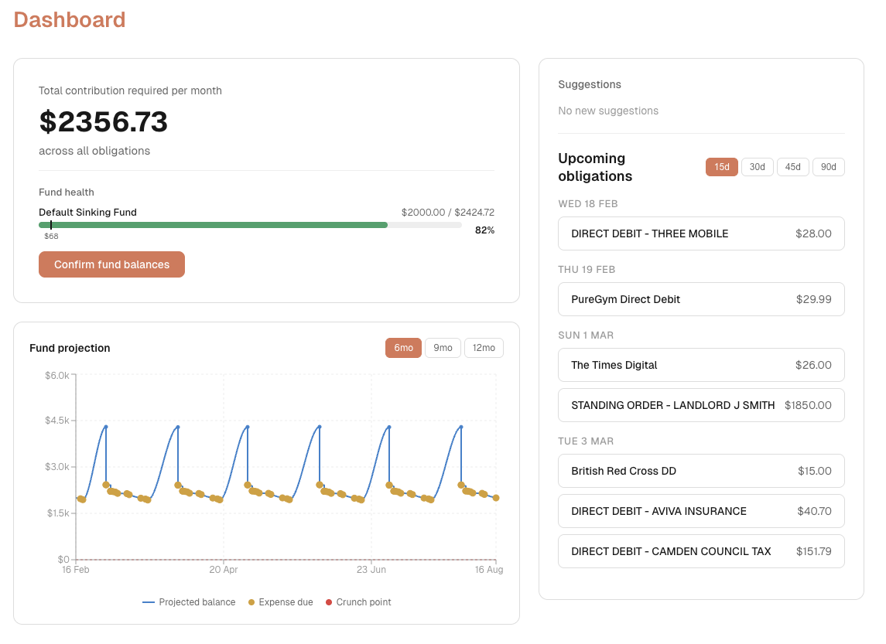

# Sinking Fund Budget Tracker

**Anthropic Claude Code Hackathon Entry** | [MIT License](LICENSE)

A sinking fund budget tracker that tells you exactly how much to set aside each pay cycle so you're never caught short. Monthly subscriptions, annual fees, tax repayments over 22 months, a fortnightly paycheck — it handles the math so you don't have to.

<picture>
  <source media="(prefers-color-scheme: dark)" srcset="web/public/dashboard-dark.png">
  <source media="(prefers-color-scheme: light)" srcset="web/public/dashboard-light.png">
  
</picture>

## The Problem

Most people have a mix of regular and irregular expenses: rent every month, car registration once a year, insurance quarterly, a holiday in December. Income arrives on a fixed schedule, but expenses don't. The result? People scramble when big bills hit, raid savings meant for other things, or just hope for the best.

Spreadsheets can model this, but they're tedious to set up and maintain. Traditional budgeting apps track what you've already spent — they don't help you plan ahead for what's coming.

## The Solution

This app manages **sinking funds**: virtual pools of money earmarked for future expenses. You tell it what you owe, when it's due, and how often you get paid. It calculates your per-cycle contribution — the exact amount to set aside from each paycheck so every bill is covered when it arrives.

The engine adapts in real time. Fall behind? It ramps up contributions to catch up before the deadline. Get ahead? Contributions ease off. A new expense appears? Everything recalculates instantly. The 6-12 month projection timeline shows exactly where your money needs to be and flags crunch points before they become emergencies.

## How It Addresses the Hackathon Problem Statements

### 1. Build a Tool That Should Exist

Sinking fund math is straightforward in concept but painful in practice. With multiple obligations on different frequencies, overlapping due dates, and variable income, the calculations compound quickly. This app eliminates that busywork entirely — add your income and obligations, and the engine handles the rest.

### 2. Break the Barriers

Financial planning shouldn't require spreadsheet expertise. The app uses Claude to let users interact in plain English:

- *"Add Netflix $22.99 monthly"*
- *"Car rego $850 due July"*
- *"Change my gym membership to $60"*
- *"What's my biggest expense in March?"*

Upload a bank statement (PDF, CSV, or OFX) and AI-powered pattern detection identifies recurring expenses and income sources automatically — no manual data entry required.

### 3. Amplify Human Judgment

The AI doesn't make financial decisions for you. It sharpens your ability to plan:

- **What-if modeling** — *"What if I cancel gym?"* or *"What if rent goes up 5%?"* See the impact on your projections instantly with scenario overlays on the dashboard.
- **Escalation modeling** — Model future price increases (rent up 3% every July, insurance up 8% at renewal) and see how contributions need to adjust ahead of time.
- **Pattern suggestions** — After importing transactions, the system surfaces detected patterns with confidence levels. You decide what to track — it just highlights what it found.

The human stays in the loop at every step. All data changes require confirmation before applying.

## Selected Hackathon Track

Submitting under **Track 1: Build a Tool That Should Exist** as the primary track — sinking fund budgeting is a well-understood concept but existing tools make it tedious, and the AI-native interaction layer makes the hard parts (data entry, what-if exploration, pattern discovery) effortless.

This project also addresses **Track 2: Break the Barriers** because it takes financial planning that's traditionally locked behind spreadsheet expertise and puts it in everyone's hands through natural language and automated statement import, and **Track 3: Amplify Human Judgment** because the what-if modeling, escalation forecasting, and pattern suggestions make users dramatically better at planning their finances — and financial advisers can use it with clients to model scenarios and communicate recommendations more effectively, all without the AI ever making decisions for them.

## Key Features

- **Sinking fund engine** with adaptive contributions, fund groups, and capacity-aware prioritization
- **Natural language interaction** via a floating AI bar and contextual sparkle buttons on every item
- **Bank statement import** supporting PDF (AI vision-based parsing), CSV, and OFX with smart deduplication
- **Pattern detection** that automatically identifies recurring income and expenses from imported transactions
- **Dashboard** with per-cycle contribution totals, fund health bars, 6-12 month timeline projections, and upcoming obligation views
- **What-if scenarios** — toggle obligations, adjust amounts, add hypotheticals, compare against actuals
- **Price escalation modeling** — one-off or recurring increases, factored into future contribution calculations
- **Multiple obligation types** — recurring indefinite, recurring with end date, one-off future expenses, custom schedules
- **Guided onboarding** — start from a bank statement upload or manual entry, with the AI helping along the way
- **Balance confirmation** — periodically verify actual fund balances against projections to stay accurate
- **Dark mode** support

## Tech Stack

| Layer | Technology |
|-------|-----------|
| Framework | Next.js 16 (App Router, TypeScript) |
| Database | PostgreSQL 17 with Prisma 7 ORM |
| AI | Anthropic Claude API (Sonnet 4.5 for NL parsing, Opus for PDF vision) |
| Frontend | React 19, CSS Modules, Recharts |
| Testing | Vitest, React Testing Library, Playwright |
| Infrastructure | Docker Compose |

## Getting Started

### Prerequisites

- Docker (via [OrbStack](https://orbstack.dev/), [Colima](https://github.com/abiosoft/colima), or [Docker Desktop](https://www.docker.com/))
- [devports](https://github.com/bendechrai/devports) for local port management
- An [Anthropic API key](https://console.anthropic.com/) for AI features (optional — the app is fully usable without it)

### Run It

```bash
# Start the app and database
./dev.sh

# Open in your browser
open http://localhost:3000
```

The app runs in Docker — no local Node.js or PostgreSQL installation needed.

### Stop It

```bash
./dev.sh down
```

## How It Was Built

This project was built from scratch during the hackathon using **Claude Code** as the primary development tool. The workflow:

1. **Specs** — Feature specifications written in markdown (`specs/`), describing user-facing behavior, data models, and acceptance criteria
2. **Ralph** — An autonomous AI build agent that reads specs, plans implementation as atomic tasks, and builds each one with full validation (type checking, linting, tests)
3. **Iteration** — Ralph builds one task at a time, validates, commits, and moves to the next. If validation fails and can't be auto-fixed, it reverts and stops cleanly.

```bash
./ralph.sh plan    # Read specs, generate implementation plan
./ralph.sh build   # Build tasks iteratively with validation
./ralph.sh status  # Check progress
```

## License

[MIT](LICENSE)
