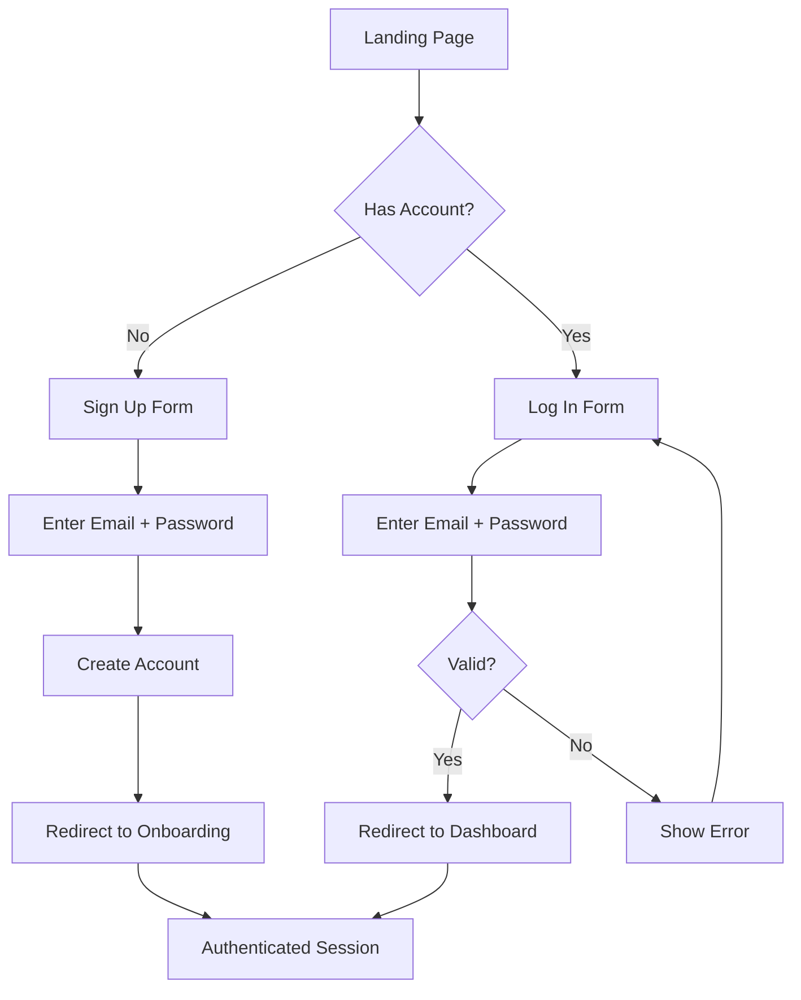

# Auth & User Management

## Overview

Simple email/password authentication. Each user's data is completely siloed. Users who want to share finances (e.g. a couple) can share login credentials — no need for team or household features.

## User Flow

## Behavior

- User can sign up with email and password
- User can log in with email and password
- User can log out
- User can reset password via email
- Session persists across browser refreshes
- All data endpoints require authentication
- All queries are scoped to the authenticated user's data

## Data Model

- `User`: id, email (unique), passwordHash, currencySymbol (default "$"), createdAt, updatedAt

## Edge Cases

- Duplicate email on signup: show "email already registered"
- Invalid credentials on login: generic "invalid email or password" (don't reveal which field is wrong)
- Expired session: redirect to login, preserve intended destination for post-login redirect
- Password requirements: minimum 8 characters

## Acceptance Criteria

- [ ] User can create an account with email and password
- [ ] User can log in and receives a persistent session
- [ ] User can log out
- [ ] User can reset their password via email
- [ ] Unauthenticated requests are redirected to login
- [ ] All data is scoped to the authenticated user
- [ ] Passwords are securely hashed (never stored in plain text)
