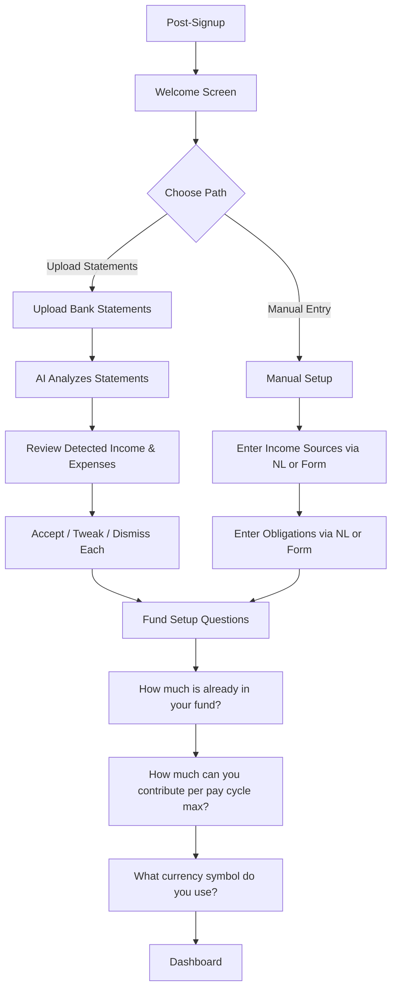

# Onboarding

## Overview

First-time user experience after signup. Two equally prominent paths: upload bank statements for AI-powered analysis, or manually enter income and expenses. Both paths collect the user's current fund balance and contribution capacity. The goal is to reach a useful dashboard as quickly as possible.

## User Flow

## Behavior

- Welcome screen explains the sinking fund concept and presents two equally visible paths side by side
- **Statement upload path**: user uploads one or more statements, system detects patterns, presents suggestions for review (accept/tweak/dismiss each)
- **Manual path**: user adds income sources and obligations one at a time using NL input or traditional forms
- Both paths converge on fund setup: current fund balance, maximum contribution capacity per cycle, contribution cycle type (radio buttons: Weekly/Fortnightly/Twice monthly/Monthly), currency symbol (quick-pick buttons + custom input)
- User can skip any step and complete it later
- Onboarding state is tracked — user can resume if they leave partway through
- Returning users who have completed onboarding go straight to the dashboard

## Data Model

- `User.onboardingComplete`: boolean (default false)
- `User.currentFundBalance`: decimal (default 0)
- `User.maxContributionPerCycle`: decimal (nullable)
- `User.contributionCycleType`: enum (nullable — weekly, fortnightly, twice_monthly, monthly)
- `User.currencySymbol`: string (default "$")

## Edge Cases

- User abandons onboarding midway: can resume from where they left off on next login
- User skips statement upload: no suggestions generated, can upload later from main app
- User skips manual entry: dashboard shows empty state with prompts to add data
- User has no fund yet: balance = 0 is valid
- User doesn't know max contribution: allow "I'm not sure" option — system can suggest based on detected income minus detected expenses
- User uploads statements but no patterns are detected: gracefully move to fund setup with message "we didn't detect clear patterns — you can add income and expenses manually"

## Acceptance Criteria

- [ ] Welcome screen appears after first signup
- [ ] Two paths are equally prominent (no primary/secondary bias)
- [ ] Statement upload path: files are analyzed and suggestions presented
- [ ] Manual path: user can add income and expenses via NL or forms
- [ ] Both paths lead to fund setup questions
- [ ] User can skip any step
- [ ] Onboarding state persists across sessions
- [ ] Completed onboarding redirects to dashboard on future logins
- [ ] "I'm not sure" option for contribution capacity
