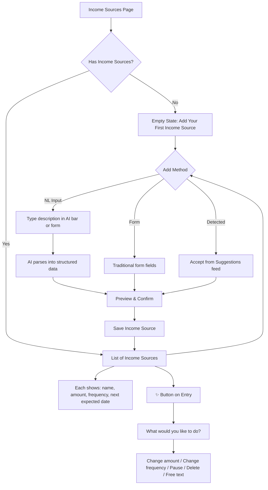

# Income Sources

## Overview

Users can add multiple income sources with varying frequencies and amounts. Income can be regular (salary, benefits, child support) or irregular (gig work, freelance, LLC passthrough). The system uses income patterns to calculate per-cycle contribution amounts and to time "set aside by" recommendations.

## User Flow

## Behavior

- User can create income sources via NL input, traditional form, or by accepting suggestions from bank statement analysis
- Each income source has: name, expected amount, frequency, variability flag
- Supported frequency types: weekly, fortnightly, monthly, quarterly, annual, custom (every N days), irregular/ad-hoc
- **Regular income**: system knows the next expected date and amount
- **Irregular income**: system calculates average amount per period from transaction history; uses minimum expected amount for conservative sinking fund calculations
- **Variable amounts**: even regular income can vary (e.g. two monthly paychecks with different amounts). System tracks expected amount but allows for variation.
- User can edit any income source via the ✨ sparkle button (with contextual presets) or the floating AI bar
- User can pause an income source (temporarily excluded from calculations)
- User can delete income sources (with confirmation)
- Deleting or pausing triggers an engine recalculation

## Data Model

- `IncomeSource`: id, userId, name, expectedAmount, frequency (enum: weekly, fortnightly, monthly, quarterly, annual, custom, irregular), frequencyDays (nullable — for custom frequency), isIrregular (boolean), minimumExpected (nullable — for irregular income), nextExpectedDate (nullable), isPaused (boolean, default false), isActive (boolean, default true), createdAt, updatedAt

## Edge Cases

- No income sources: dashboard still works but shows warning "add income sources for per-cycle recommendations"
- Irregular income with no transaction history: prompt user for estimated minimum per period
- Income source deleted: triggers sinking fund engine recalculation
- Amount changes over time: user can update expected amount; historical data is unaffected
- Multiple incomes on the same day: both are counted
- NL input ambiguous: show best interpretation, allow correction before saving

## Acceptance Criteria

- [ ] User can add income via NL input
- [ ] User can add income via traditional form
- [ ] User can accept detected income from suggestions
- [ ] All frequency types are supported (weekly through irregular)
- [ ] Irregular income uses minimum expected for conservative calculations
- [ ] User can edit income via sparkle button (presets + free text)
- [ ] User can edit income via floating AI bar
- [ ] User can pause and resume income sources
- [ ] User can delete income with confirmation
- [ ] Income list shows name, amount, frequency, next expected date
- [ ] Empty state guides user to add first income source
- [ ] Changes trigger engine recalculation
