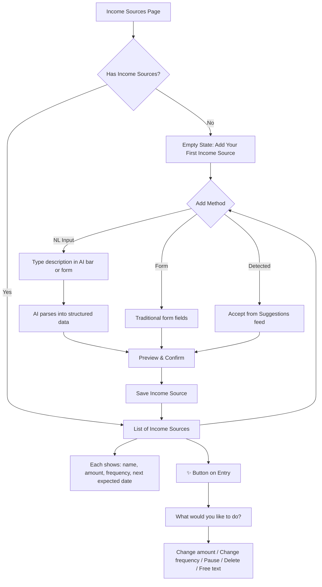

# Income Sources

## Overview

Users can add multiple income sources with varying frequencies and amounts. Income can be regular (salary, benefits, child support) or irregular (gig work, freelance, LLC passthrough). The system uses income patterns to calculate per-cycle contribution amounts and to time "set aside by" recommendations.

## User Flow

```mermaid
flowchart TD
    A[Income Sources Page] --> B{Has Income Sources?}
    B -->|No| C[Empty State: Add Your First Income Source]
    B -->|Yes| D[List of Income Sources]
    D --> E[Each shows: name, amount, frequency, next expected date]
    C --> F{Add Method}
    D --> F
    F -->|NL Input| G[Type description in AI bar or form]
    F -->|Form| H[Traditional form fields]
    F -->|Detected| I[Accept from Suggestions feed]
    G --> J[AI parses into structured data]
    J --> K[Preview & Confirm]
    H --> K
    I --> K
    K --> L[Save Income Source]
    L --> D
    D --> M[✨ Button on Entry]
    M --> N[What would you like to do?]
    N --> O[Change amount / Change frequency / Pause / Delete / Free text]
```

## Behavior

- User can create income sources via NL input, traditional form, or by accepting suggestions from bank statement analysis
- Each income source has: name, expected amount, frequency (as interval unit + count), next expected date
- Frequency is expressed as "Every N [unit]" where unit is one of: day, week, twice_monthly, month, quarter, year. Combined with an interval count (e.g. every 2 weeks, every 1 month)
- There is no separate "irregular" frequency. If income varies, the user enters a conservative estimate for the amount and period they can count on
- When accepting irregular income suggestions from pattern detection, the system computes a conservative baseline (average or median per-period amount) and creates the income source with that baseline
- **Variable amounts**: even regular income can vary (e.g. two monthly paychecks with different amounts). System tracks expected amount but allows for variation.
- User can edit any income source via the ✨ sparkle button (with contextual presets) or the floating AI bar
- User can pause an income source (temporarily excluded from calculations)
- User can delete income sources (with confirmation)
- Deleting or pausing triggers an engine recalculation

## Data Model

- `IncomeSource`: id, userId, name, expectedAmount, intervalUnit (enum: day, week, twice_monthly, month, quarter, year), intervalCount (integer, default 1), minimumExpected (nullable — for variable income), nextExpectedDate (nullable), isPaused (boolean, default false), isActive (boolean, default true), createdAt, updatedAt

## Edge Cases

- No income sources: dashboard still works but shows warning "add income sources for per-cycle recommendations"
- Income source deleted: triggers sinking fund engine recalculation
- Amount changes over time: user can update expected amount; historical data is unaffected
- Multiple incomes on the same day: both are counted
- NL input ambiguous: show best interpretation, allow correction before saving

## Acceptance Criteria

- [ ] User can add income via NL input
- [ ] User can add income via traditional form
- [ ] User can accept detected income from suggestions
- [ ] All frequency types are supported via "Every N [unit]" controls
- [ ] Variable income: helper text guides user to enter a conservative estimate
- [ ] User can edit income via sparkle button (presets + free text)
- [ ] User can edit income via floating AI bar
- [ ] User can pause and resume income sources
- [ ] User can delete income with confirmation
- [ ] Income list shows name, amount, frequency, next expected date
- [ ] Empty state guides user to add first income source
- [ ] Changes trigger engine recalculation
