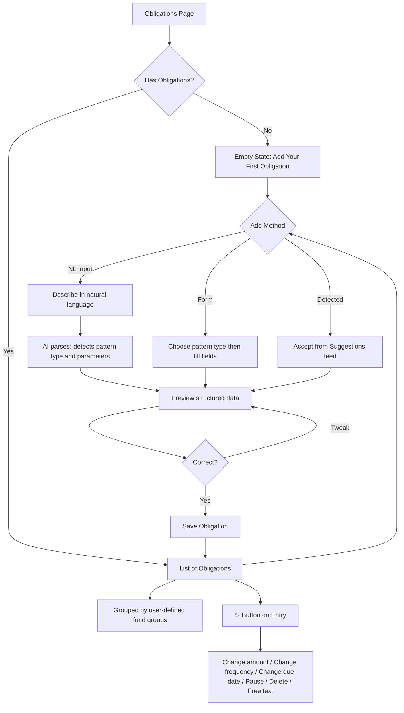

# Expenses & Obligations

## Overview

Users track four types of financial obligations. Each obligation represents money that needs to be available at a specific time. The system uses these to calculate sinking fund contributions.

### Four Obligation Patterns

1. **Recurring indefinitely** — Netflix, rent, insurance (same amount, regular cycle, no end date)
2. **Recurring with end date** — Tax repayment plan ($200/month for 22 months)
3. **One-off future expense** — Car registration due in July, holiday in December
4. **Custom schedule** — Known amounts on known dates that don't follow a clean pattern (e.g. Melbourne council tax: 10 payments Sept–June, first 9 are 1/10 of total rounded to nearest dollar, 10th is the remainder)

## User Flow

## Behavior

- User can create obligations via NL input, traditional form, or by accepting suggestions from bank statement analysis
- NL input examples:
  - "Netflix $22.99 monthly"
  - "Car rego $850 due every July"
  - "Tax repayment $200 per month for 22 months starting March 2026"
  - "Council tax $1,800/year, 10 payments Sept to June, first 9 are 1/10 rounded to nearest dollar, last one is the remainder"
- Each obligation belongs to a fund group (default group if none assigned)
- Obligations can be paused (temporarily excluded from sinking fund calculations but still visible in the list)
- Completed obligations (past end date or paid one-off) are archived automatically, not deleted
- User can edit via ✨ sparkle button (contextual presets) or floating AI bar
- User can delete with confirmation
- Creating, editing, pausing, or deleting triggers engine recalculation

## Data Model

- `Obligation`: id, userId, name, type (enum: recurring, recurring_with_end, one_off, custom), amount, frequency (nullable), frequencyDays (nullable), startDate, endDate (nullable), nextDueDate, isPaused (boolean, default false), isActive (boolean, default true), isArchived (boolean, default false), fundGroupId (nullable — null means default group), createdAt, updatedAt
- `CustomScheduleEntry`: id, obligationId, dueDate, amount, isPaid (boolean, default false)
- `FundGroup`: id, userId, name, createdAt, updatedAt

## Edge Cases

- NL input ambiguous: show best interpretation with option to correct before saving
- Custom schedule with varying amounts: each payment stored individually as a CustomScheduleEntry
- Obligation paused: excluded from contribution calculations but remains visible (greyed out)
- Obligation completed: moved to archive, no longer affects calculations, viewable in archive section
- Duplicate detection: warn if a very similar obligation already exists (same vendor + similar amount + same frequency)
- Past-due obligation: highlight it, prompt user to mark as paid or adjust the date
- Melbourne council tax example must work end to end through NL parsing

## Acceptance Criteria

- [ ] User can create all four obligation types via NL input
- [ ] User can create all four obligation types via traditional form
- [ ] User can accept detected obligations from suggestions
- [ ] Custom schedules support arbitrary dates and varying amounts per entry
- [ ] NL parser correctly interprets common expense patterns
- [ ] Melbourne council tax example works end to end
- [ ] Obligations can be paused and resumed
- [ ] Completed obligations are automatically archived
- [ ] Obligations can be assigned to fund groups
- [ ] Sparkle button shows contextual action presets
- [ ] Sparkle button includes free text option
- [ ] Empty state guides user to add first obligation
- [ ] Changes trigger engine recalculation
- [ ] Past-due obligations are visually highlighted
