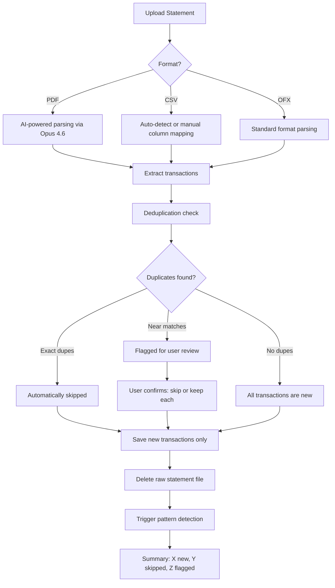

# Bank Statement Import

## Overview

Users upload bank statements in PDF, CSV, or OFX format. The system parses transactions, deduplicates against previously imported data, and stores them for pattern detection. Raw statement files are deleted after processing — only extracted transaction data is retained. Privacy is a first-class concern.

## User Flow

## Behavior

- Upload supports drag-and-drop and file picker
- **PDF parsing**: uses AI (Opus 4.6) to extract transaction date, description, amount, and any reference/ID from statement layouts
- **CSV parsing**: auto-detects common bank CSV column layouts; falls back to manual column mapping if auto-detect fails
- **OFX parsing**: standard format, direct field extraction
- **Deduplication strategy** (layered):
  1. **Transaction ID / reference number** if present in the data — exact match, auto-skip
  2. **Composite fingerprint**: hash of (date + amount + description) — catches exact duplicates across files
  3. **Fuzzy matching**: near-matches (same date + similar amount, similar description) — flagged for user review rather than silently deduped
- Raw statement files are deleted immediately after successful parsing and extraction
- Imported transactions are stored with: date, description, amount, type (credit/debit), reference ID (if available), dedup fingerprint, source filename, import timestamp
- User can view import history and browse imported transactions
- Re-uploading the same file shows "no new transactions" if all match existing records
- Ongoing uploads: users can upload new statements at any time to keep data current

## Data Model

- `Transaction`: id, userId, date, description, amount, type (enum: credit, debit), referenceId (nullable), fingerprint (hash string), sourceFileName, importedAt, createdAt
- `ImportLog`: id, userId, fileName, format (enum: pdf, csv, ofx), transactionsFound, transactionsImported, duplicatesSkipped, duplicatesFlagged, importedAt

## Edge Cases

- PDF with unusual or non-standard formatting: AI parsing may produce low-confidence results — flag these transactions for user review with confidence indicators
- CSV with no headers: prompt user to identify columns manually
- CSV with non-standard date formats: auto-detect common formats or let user specify
- Same amount + same vendor + same day (legitimate double payment): fuzzy match flags for review, user explicitly confirms both are real transactions
- Corrupt or unreadable file: clear error message, no partial import
- Very large files: show progress indicator, process in background
- Statement from a new bank with unfamiliar format: CSV column mapping handles this; PDF handled by AI flexibility
- Multiple statements uploaded at once: process sequentially, deduplicate across all

## Acceptance Criteria

- [ ] User can upload PDF statements and transactions are extracted via AI
- [ ] User can upload CSV statements with auto-detect or manual column mapping
- [ ] User can upload OFX statements
- [ ] Exact duplicate transactions are automatically skipped
- [ ] Near-duplicate transactions are flagged for user review
- [ ] Raw statement files are deleted immediately after processing
- [ ] Import summary shows counts: new, skipped, flagged
- [ ] Import history is viewable with date, filename, and counts
- [ ] Re-uploading the same file results in zero new transactions
- [ ] Large files show a progress indicator
- [ ] User can browse imported transactions
- [ ] Multiple files can be uploaded in sequence
