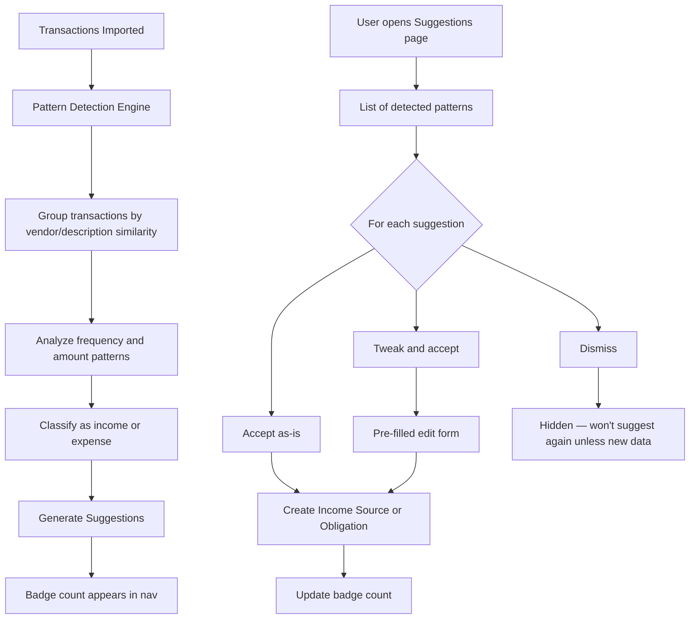

# Pattern Detection & Suggestions

## Overview

After bank statement import, the system analyzes transactions to detect recurring patterns — both income and expenses. Detected patterns are presented as suggestions that users can accept (creating income sources or obligations), tweak and accept, or dismiss. Suggestions are accessible via a dedicated feed with a badge count in the navigation.

## User Flow

## Behavior

- Pattern detection runs automatically after each statement import
- **Detection looks for**:
  - Regular recurring transactions: same vendor, similar amount, regular interval (weekly/fortnightly/monthly/quarterly/annual)
  - Income patterns: regular credits of similar amounts
  - Subscription-like charges: same amount at consistent monthly intervals
  - Annual or quarterly charges: same vendor at larger intervals
  - Irregular but recurring: same vendor, varying amounts, variable timing
- **Each suggestion displays**:
  - Vendor/description
  - Detected amount (single value for consistent amounts, range for variable)
  - Detected frequency
  - Confidence level: high, medium, or low
  - Number of matching transactions found
  - Suggested classification: income or expense, and which obligation pattern type
- **User actions**:
  - **Accept**: creates an income source or obligation with the detected parameters
  - **Tweak**: opens a pre-filled form where the user can adjust any field before saving
  - **Dismiss**: hides the suggestion; same pattern won't be re-suggested unless significant new transaction data strengthens the case
- Suggestions feed is accessible via a nav item with a badge showing the count of pending suggestions
- High-confidence suggestions may also appear as smart nudge cards on the dashboard
- Already-tracked income sources and obligations are not re-suggested (matched by vendor pattern and amount similarity)

## Data Model

- `Suggestion`: id, userId, type (enum: income, expense), vendorPattern, detectedAmount, detectedAmountMin (nullable — for variable amounts), detectedAmountMax (nullable), detectedFrequency (enum), confidence (enum: high, medium, low), matchingTransactionCount, status (enum: pending, accepted, dismissed), linkedIncomeSourceId (nullable), linkedObligationId (nullable), createdAt, updatedAt
- `SuggestionTransaction`: suggestionId, transactionId (junction table linking a suggestion to its matching transactions)

## Edge Cases

- Insufficient data: fewer than 2 matching transactions → mark as low confidence or don't suggest at all
- Amount varies significantly: show the range (min–max) and suggest using the average or maximum
- Price changes over time (e.g. Netflix price increase): detect most recent amount, note the change history
- Dismissed suggestion with new evidence: if new imported transactions significantly strengthen the pattern after dismissal, re-surface with a note "new data supports this pattern"
- Vendor name varies across transactions (e.g. "NETFLIX.COM" vs "Netflix" vs "NETFLIX"): fuzzy vendor matching with normalization
- Already tracked: if user already has a matching income source or obligation, exclude from suggestions
- No patterns detected after import: suggestions page shows "no new patterns detected — you can add income and expenses manually"

## Acceptance Criteria

- [ ] Pattern detection runs automatically after each statement import
- [ ] Recurring income is detected from credit transactions
- [ ] Recurring expenses are detected across all frequencies (monthly, quarterly, annual, etc.)
- [ ] Variable-amount recurring patterns are detected with min/max ranges
- [ ] Each suggestion shows vendor, amount/range, frequency, confidence, and transaction count
- [ ] User can accept a suggestion as-is (creates income source or obligation)
- [ ] User can tweak and accept a suggestion (pre-filled form)
- [ ] User can dismiss a suggestion
- [ ] Dismissed patterns are not re-suggested unless significant new data appears
- [ ] Nav shows badge count for pending suggestions
- [ ] High-confidence suggestions appear as dashboard nudge cards
- [ ] Already-tracked patterns are excluded from suggestions
- [ ] Fuzzy vendor name matching works across common variations
