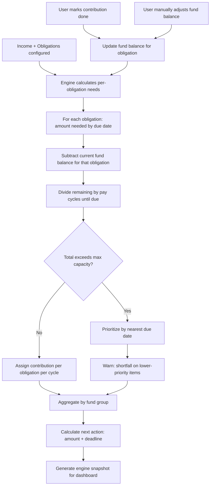

# Sinking Fund Engine

## Overview

The core calculation engine. Every obligation has its own virtual fund that tracks how much has been notionally set aside for it. The engine calculates adaptive contribution amounts — including ramp-up periods when the user is behind and ramp-down when they're ahead. Users see contributions aggregated by fund group. The system is purely informational: it tells users what to set aside, and users self-verify.

## User Flow

## Behavior

### Per-Obligation Calculation

- Each obligation has a virtual fund balance tracking how much has been set aside
- For each obligation, the engine calculates:
  - Total amount needed by next due date
  - Remaining amount (total minus already set aside)
  - Number of pay cycles remaining until due date
  - Required contribution per cycle to be fully funded on time
- For recurring obligations: once a due date passes, the cycle resets and begins accumulating for the next occurrence

### Adaptive Contributions

- **Steady state**: remaining needed ÷ cycles remaining = even contribution per cycle
- **Ramp-up**: if the user started late, is behind, or a new obligation was added mid-cycle — contributions are higher than steady state, constrained by the user's max contribution capacity
- **Ramp-down**: if the user is ahead (over-contributed or an obligation was removed) — contributions decrease
- The engine respects the user's stated maximum contribution per cycle
- If total required contributions exceed capacity, the engine prioritizes by due date (nearest first) and warns about shortfalls on lower-priority items

### Fund Groups

- Each obligation belongs to a fund group (or the default group)
- User creates, renames, and deletes groups in preferences
- Obligations can be moved between groups at any time (just re-tagging, no balance migration)
- Dashboard can show per-group totals and health alongside the combined view

### Self-Verification

- The system tells users what to set aside — it does not connect to bank accounts or move money
- Users can mark a contribution as "done" to update the virtual fund balance
- Users can manually adjust any fund balance at any time (e.g. after checking their actual bank account)

### Next Action Calculation

- The engine determines the most urgent next action: "You need to set aside $X by [date]"
- The date is based on the nearest obligation due date that requires funding
- If all obligations are fully funded for the near term, the next action shows the ongoing steady-state amount and next cycle date

## Data Model

- `FundBalance`: id, obligationId, currentBalance (decimal), lastUpdatedAt
- `ContributionRecord`: id, obligationId, amount, date, type (enum: contribution, manual_adjustment), note (nullable), createdAt
- `EngineSnapshot`: id, userId, calculatedAt, totalRequired (decimal), totalFunded (decimal), nextActionAmount (decimal), nextActionDate (date), nextActionDescription (string)

## Edge Cases

- No income sources configured: engine can still calculate total amounts needed by date, but cannot recommend per-cycle contributions — show totals with a prompt to add income
- Max contribution capacity exceeded: warn user with specific numbers ("you need $X/cycle but your max is $Y — you'll be $Z short for [obligation] due [date]")
- Obligation due before enough cycles remain to fund it: immediate warning — "you need $X in Y days but can only save $Z in that time at your current capacity"
- All obligations fully funded: celebration state — "you're fully covered!"
- New obligation added mid-cycle: engine recalculates immediately, may trigger ramp-up
- Obligation deleted: releases the virtual fund balance (contribution records are kept for history)
- Obligation paused: excluded from calculations, fund balance frozen
- Zero income, zero obligations: empty dashboard state
- User adjusts fund balance to more than needed: excess is noted, contributions drop to zero for that obligation

## Acceptance Criteria

- [ ] Each obligation has an independent virtual fund balance
- [ ] Engine calculates required contribution per pay cycle per obligation
- [ ] Contributions are adaptive: ramp-up when behind, ramp-down when ahead
- [ ] Max contribution capacity is respected as a hard ceiling
- [ ] When capacity is exceeded, obligations are prioritized by nearest due date
- [ ] Shortfall warnings identify specific obligations and amounts
- [ ] Fund groups aggregate obligation balances correctly
- [ ] User can mark contributions as done (updates fund balance)
- [ ] User can manually adjust any fund balance
- [ ] Engine recalculates on any change (new/edited/deleted/paused obligation or income)
- [ ] Engine snapshot includes next action with amount, date, and description
- [ ] Recurring obligations reset their cycle after a due date passes
- [ ] Celebration state when all obligations are fully funded
