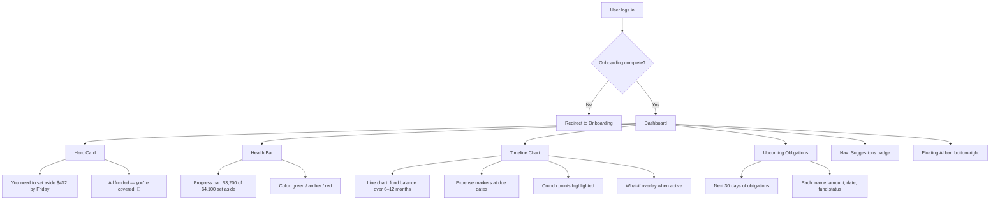

# Dashboard

## Overview

The main view after login. Shows the user's sinking fund health at a glance: what to do next, whether they're on track, a forward timeline projection, and upcoming obligations. Responsive design — works across desktop and mobile.

## User Flow

## Behavior

### Hero Card

- Displays the single most actionable item: "You need to set aside $412 by Friday"
- The deadline is based on when funds are needed (nearest under-funded obligation due date), not when income arrives
- Updates in real time as contributions are marked done
- If all obligations are fully funded for the foreseeable future: celebration/confirmation state
- If no data exists: prompts user to add income or obligations

### Health Bar

- Visual progress indicator: total funded across all obligations vs. total currently required
- Color coded: green (on track or ahead), amber (slightly behind), red (significantly behind)
- Shows absolute numbers alongside the bar: "$3,200 of $4,100 set aside"
- Optionally expandable to show per-fund-group breakdown

### Timeline Chart

- Line chart projecting fund balance over a configurable 6–12 month window
- X axis: time (months), Y axis: fund balance (currency)
- Expense markers: dots or vertical lines where obligations are due (balance dips)
- Contribution markers: where balance increases from set-asides
- Crunch points: highlighted zones where projected balance dips close to zero or goes negative
- Supports what-if overlay: solid line for actual projection, dashed line for scenario (see spec 10)
- User can adjust the time range

### Upcoming Obligations

- Lists obligations due in the next 30 days
- Each item shows: obligation name, amount, due date, and fund status (fully funded / partially funded / unfunded)
- Sorted by due date (nearest first)
- Tapping/clicking an item navigates to the obligation detail
- Multiple obligations on the same day are grouped

### Smart Nudges (from Pattern Detection)

- High-confidence suggestions may appear as dismissible cards on the dashboard
- Example: "We noticed a new $14.99 monthly charge from Spotify starting in January. Add it?"
- Links to the suggestions feed for full review

### Responsive Layout

- **Desktop**: hero card + health bar side by side at top, timeline chart spanning full width below, upcoming obligations in a sidebar or below the chart
- **Mobile**: single column stack — hero card, health bar, upcoming (condensed), timeline chart (horizontal scrollable)

## Data Model

- No new models — dashboard reads from `EngineSnapshot`, `Obligation`, `FundBalance`, `FundGroup`, and `Suggestion`

## Edge Cases

- No obligations: prompt — "Add your first obligation to get started"
- No income: warning card — "Add income sources so we can calculate per-cycle amounts"
- All obligations fully funded: hero card shows celebration state
- Fund projected to go negative: crunch point highlighted in red with warning text
- Many obligations due on the same day: grouped in upcoming list with combined total
- Very long time horizon (>12 months): allow zoom/scroll on timeline chart
- User has only completed onboarding partially: show contextual prompts for missing data

## Acceptance Criteria

- [ ] Hero card shows next action with amount and deadline
- [ ] Hero card updates when contributions are marked done
- [ ] Hero card shows celebration state when fully funded
- [ ] Hero card shows prompts when no data exists
- [ ] Health bar shows funded vs. required with color coding (green/amber/red)
- [ ] Health bar shows absolute numbers
- [ ] Health bar is expandable to per-group breakdown
- [ ] Timeline chart projects fund balance 6–12 months forward
- [ ] Expense markers appear on timeline at obligation due dates
- [ ] Crunch points are visually highlighted
- [ ] Timeline supports what-if overlay (solid vs. dashed line)
- [ ] Time range is adjustable
- [ ] Upcoming obligations list shows next 30 days
- [ ] Each upcoming item shows name, amount, date, and fund status
- [ ] Smart nudge cards appear for high-confidence suggestions
- [ ] Dashboard is responsive (desktop and mobile layouts)
- [ ] Empty states guide user to add data
