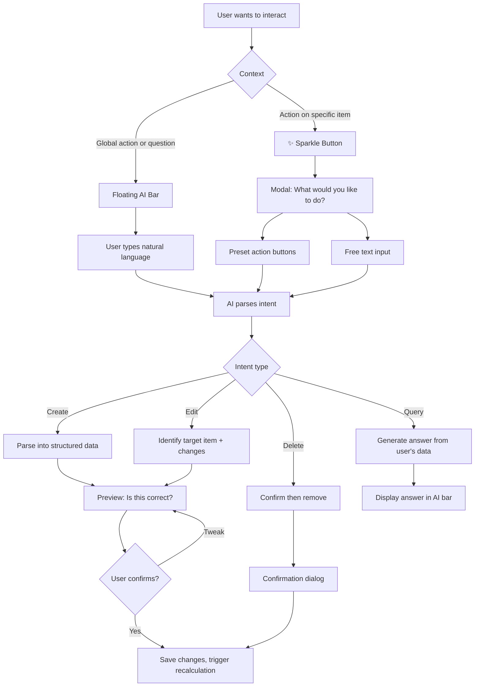

# AI Interaction Layer

## Overview

Three complementary AI interaction modes that users discover naturally at different moments: a floating draggable bar for freeform input, per-item sparkle buttons for contextual actions, and natural language parsing that powers both. Users can create, edit, query, and manage income sources and obligations using plain language.

## User Flow

## Behavior

### Floating AI Bar

- Renders as a collapsed pill/icon in the bottom-right corner by default
- User can expand it to reveal a text input field
- Draggable — user can reposition it anywhere on screen to avoid obscuring content
- Persists across page navigation (does not reset position or state on route change)
- Supports all operations: create, edit, delete, query
- Input examples:
  - **Create**: "Add Netflix $22.99 monthly"
  - **Create complex**: "Council tax $1,800/year, 10 payments Sept to June, first 9 are 1/10 rounded to nearest dollar, last is remainder"
  - **Edit**: "Change my gym membership to $60"
  - **Query**: "What's my biggest expense in March?"
  - **Query**: "How much do I need to save this week?"
  - **Query**: "What if I cancel the gym?" (triggers what-if mode)
  - **Delete**: "Delete the Spotify subscription"
  - **Income**: "I get paid $3,200 every second Friday"

### Sparkle Button (✨)

- Appears on every income source and obligation in list views
- Opens a modal/popover containing:
  - Item summary at the top (name, amount, frequency)
  - Contextual preset action buttons:
    - **Income presets**: Change amount, Change frequency, Pause, Delete
    - **Obligation presets**: Change amount, Change frequency, Change due date, Pause, Delete
  - Free text input at the bottom: "Describe what you'd like to change"
- Preset buttons generate a structured intent directly (no NL parsing needed)
- Free text goes through the full NL parser

### NL Parser

- Parses natural language into structured actions
- Handles: creation, editing, querying, deletion
- **Creation**: identifies type (income/expense), amount, frequency, dates, and obligation pattern
- **Editing**: identifies which existing item to modify and what fields to change
- **Queries**: interprets questions and generates answers from the user's financial data
- **Deletion**: identifies which item to remove
- Always shows a preview before making any data changes (queries respond immediately)
- Ambiguous input: asks for clarification ("Which subscription did you mean?")
- Unrecognized input: suggests what it can help with

### Non-Gating Design

- A user who never touches the floating AI bar and never types free text can still use the full app through traditional forms, suggestions, and sparkle presets
- The AI features enhance the experience but do not gate any functionality

## Data Model

- No new persistent models for core functionality — the AI layer operates on existing Income Source, Obligation, and Fund data
- `AIInteractionLog`: id, userId, rawInput, parsedIntent (JSON), actionTaken, success (boolean), createdAt (used for improving parsing quality over time)

## Edge Cases

- Ambiguous target: "change the subscription" when multiple subscriptions exist — ask "Which one? Netflix ($22.99), Spotify ($14.99), or Disney+ ($13.99)?"
- Ambiguous intent: "Netflix" with no verb — ask "Would you like to add Netflix as a new expense, or edit your existing Netflix entry?"
- No matching item for edit/delete: "I couldn't find that. Did you mean [closest match]?"
- Query with no data: "You don't have any expenses tracked yet. Would you like to add one?"
- Very complex NL (council tax example): parse to best effort, always show preview for user confirmation
- Irrelevant input: graceful deflection — "I help with budgeting and expenses. Try something like 'Add rent $1,500 monthly'"
- Multiple items in one command: "Add Netflix $22.99 monthly and Spotify $14.99 monthly" — handle both, show preview for each

## Acceptance Criteria

- [ ] Floating AI bar renders collapsed in bottom-right corner
- [ ] Floating AI bar expands to show text input
- [ ] Floating AI bar is draggable to any screen position
- [ ] Floating AI bar persists across page navigation
- [ ] User can create income sources via NL
- [ ] User can create all four obligation types via NL
- [ ] User can edit existing items via NL
- [ ] User can delete items via NL (with confirmation dialog)
- [ ] User can ask questions about their financial data
- [ ] "What if" queries trigger what-if mode on the dashboard
- [ ] Sparkle button appears on all income and obligation list items
- [ ] Sparkle modal shows item summary and contextual preset buttons
- [ ] Sparkle modal includes free text input option
- [ ] All data changes show a preview before applying
- [ ] Ambiguous input triggers clarification questions
- [ ] Complex NL input (council tax example) parses correctly
- [ ] App is fully functional without ever using AI features (non-gating)
