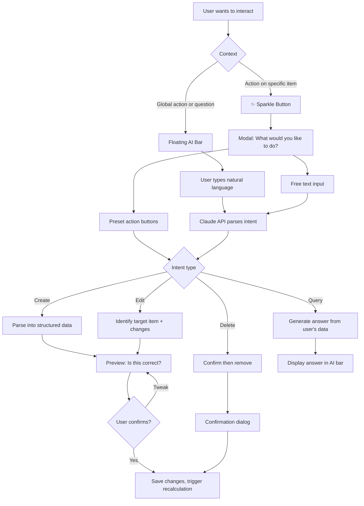

# AI Interaction Layer

## Overview

Three complementary AI interaction modes that users discover naturally at different moments: a floating draggable bar for freeform input, per-item sparkle buttons for contextual actions, and LLM-powered natural language understanding that powers both. Users can create, edit, query, and manage income sources and obligations using plain language.

All freeform text input is processed by Claude (via the Anthropic API) — not by regex or keyword matching. The LLM receives the user's input along with a system prompt defining the available actions and the user's current data context, and returns a structured JSON intent. This is the same approach used in spec 05 for PDF parsing: the LLM handles the language understanding, the application handles the execution.

## User Flow

## Behavior

### Floating AI Bar

- Renders as a collapsed pill/icon in the bottom-right corner by default
- User can expand it to reveal a text input field
- Draggable — user can reposition it anywhere on screen to avoid obscuring content
- Persists across page navigation (does not reset position or state on route change)
- Supports all operations: create, edit, delete, query
- Input examples:
  - **Create**: "Add Netflix $22.99 monthly"
  - **Create complex**: "Council tax $1,800/year, 10 payments Sept to June, first 9 are 1/10 rounded to nearest dollar, last is remainder"
  - **Edit**: "Change my gym membership to $60"
  - **Query**: "What's my biggest expense in March?"
  - **Query**: "How much do I need to save this week?"
  - **Query**: "What if I cancel the gym?" (triggers what-if mode)
  - **Delete**: "Delete the Spotify subscription"
  - **Income**: "I get paid $3,200 every second Friday"

### Sparkle Button (✨)

- Appears on every income source and obligation in list views
- Opens a modal/popover containing:
  - Item summary at the top (name, amount, frequency)
  - Contextual preset action buttons:
    - **Income presets**: Change amount, Change frequency, Pause, Delete
    - **Obligation presets**: Change amount, Change frequency, Change due date, Pause, Delete
  - Free text input at the bottom: "Describe what you'd like to change"
- Preset buttons generate a structured intent directly (no LLM call needed — these are deterministic actions)
- Free text goes through the Claude API like any other NL input

### Intent Parsing via Claude API

All freeform text — from the AI bar or sparkle button free text input — is sent to a server-side API route that calls Claude (Anthropic API, model: `claude-sonnet-4-5-20250929`). The LLM returns a structured JSON response matching a defined schema. This is not a chat — it is a single-turn structured extraction.

**API route**: `POST /api/ai/parse`

**What the LLM receives**:
- System prompt defining the available intent types, their schemas, and instructions
- The user's current financial context: list of existing income sources and obligations (names, amounts, frequencies) so the LLM can resolve references like "the gym" or "my Netflix"
- For query intents: summary financial data (totals, upcoming due dates, fund balances) so the LLM can answer questions directly
- The user's raw input text

**What the LLM returns** (structured JSON, enforced via tool use or JSON mode):
- `type`: one of `create`, `edit`, `delete`, `query`, `what_if`, `escalation`, `clarification`
- Type-specific fields:
  - **create**: `targetType` (income/obligation), `name`, `amount`, `frequency`, `startDate`, `obligationType` (monthly/fortnightly/weekly/quarterly/annual/custom), `customSchedule` (for complex patterns like the council tax example)
  - **edit**: `targetType`, `targetName` (existing item to modify), `changes` (object of field → new value)
  - **delete**: `targetType`, `targetName`
  - **query**: `answer` (natural language response string computed by the LLM from the financial context)
  - **what_if**: `changes` (array of toggles and overrides, per spec 10)
  - **escalation**: `obligationName`, `changeType`, `value`, `effectiveDate`, `intervalMonths` (per spec 11)
  - **clarification**: `message` (what the LLM needs to know), `options` (suggested choices)

**Why an LLM, not regex**:
- "Add an income of $1000 a month" — an LLM understands "income" is the type and generates a sensible name (e.g. "Income"), rather than extracting the verb "Add" as the name
- "Council tax $1,800/year, 10 payments Sept to June, first 9 are 1/10 rounded to nearest dollar, last is remainder" — requires arithmetic reasoning to produce a custom schedule
- "What's my biggest expense in March?" — requires querying the user's data and composing an answer
- "Change the subscription" when multiple exist — requires knowing the user's items and asking for clarification
- Ambiguity, typos, varied phrasing — all handled naturally by the LLM without brittle pattern matching

### Query Answering

Query intents are answered directly by Claude in the same API call. The LLM receives the user's financial summary data (income sources, obligations, fund balances, upcoming due dates, recent transactions) as context, and returns a natural language answer.

- "What's my biggest expense in March?" → LLM looks at obligations due in March and responds with the answer
- "How much do I need to save this week?" → LLM computes from the fund engine's next-action data
- "Am I on track for rent?" → LLM checks the rent fund's balance vs. target

The answer is displayed directly in the AI bar — no preview step needed for read-only queries.

### Non-Gating Design

- A user who never touches the floating AI bar and never types free text can still use the full app through traditional forms, suggestions, and sparkle presets
- The AI features enhance the experience but do not gate any functionality
- If the Anthropic API is unavailable or the API key is not configured, the AI bar should show a clear message ("AI features require an API key — you can still use the app normally") rather than failing silently

## Infrastructure

- **API key**: The web container requires `ANTHROPIC_API_KEY` in its environment. This must be added to the web service's `environment:` block in `docker-compose.yml.devports` and to `.env.devports`
- **SDK**: Use the `@anthropic-ai/sdk` npm package (already installed for PDF parsing in spec 05)
- **Model**: Use `claude-sonnet-4-5-20250929` for intent parsing (fast, capable, cost-effective for structured extraction). PDF parsing in spec 05 uses Opus because it needs vision capabilities for document layouts — NL parsing does not
- **Rate limiting**: One LLM call per user submission. No streaming needed — the response is a single JSON object
- **Error handling**: If the API call fails (network error, rate limit, invalid key), return a user-friendly error in the AI bar. Never expose raw API errors to the user
- **Latency**: Sonnet responses typically arrive in 1-2 seconds. Show a loading indicator in the AI bar while waiting

## Data Model

- No new persistent models for core functionality — the AI layer operates on existing Income Source, Obligation, and Fund data
- `AIInteractionLog`: id, userId, rawInput, parsedIntent (JSON), actionTaken, success (boolean), createdAt (used for improving parsing quality over time)

## Edge Cases

- Ambiguous target: "change the subscription" when multiple subscriptions exist — the LLM returns a `clarification` intent listing the matching items for the user to choose from
- Ambiguous intent: "Netflix" with no verb — the LLM asks "Would you like to add Netflix as a new expense, or edit your existing Netflix entry?"
- No matching item for edit/delete: "I couldn't find that. Did you mean [closest match]?"
- Query with no data: "You don't have any expenses tracked yet. Would you like to add one?"
- Very complex NL (council tax example): the LLM parses the arithmetic and schedule logic, preview shown for user confirmation
- Irrelevant input: the LLM responds with a graceful deflection — "I help with budgeting and expenses. Try something like 'Add rent $1,500 monthly'"
- Multiple items in one command: "Add Netflix $22.99 monthly and Spotify $14.99 monthly" — the LLM returns multiple intents, preview shown for each
- API key not configured: AI bar displays a setup message, rest of app works normally
- API errors: AI bar shows "Something went wrong — try again" with a retry option

## Acceptance Criteria

- [ ] Floating AI bar renders collapsed in bottom-right corner
- [ ] Floating AI bar expands to show text input
- [ ] Floating AI bar is draggable to any screen position
- [ ] Floating AI bar persists across page navigation
- [ ] NL input is parsed by Claude API (Sonnet), not regex
- [ ] LLM receives user's financial context (existing items) for reference resolution
- [ ] LLM returns structured JSON matching the defined intent schema
- [ ] User can create income sources via NL (including sensible auto-generated names)
- [ ] User can create all four obligation types via NL
- [ ] User can create complex custom schedules via NL (council tax example)
- [ ] User can edit existing items via NL
- [ ] User can delete items via NL (with confirmation dialog)
- [ ] User can ask questions about their financial data and receive computed answers
- [ ] "What if" queries trigger what-if mode on the dashboard
- [ ] Sparkle button appears on all income and obligation list items
- [ ] Sparkle modal shows item summary and contextual preset buttons
- [ ] Sparkle modal includes free text input option
- [ ] All data changes show a preview before applying
- [ ] Ambiguous input triggers clarification from the LLM
- [ ] Complex NL input (council tax example) parses correctly into a custom schedule
- [ ] App is fully functional without ever using AI features (non-gating)
- [ ] Missing API key shows a clear message, does not break the app
- [ ] API errors are handled gracefully with user-friendly messages
- [ ] Loading indicator shown while waiting for LLM response
