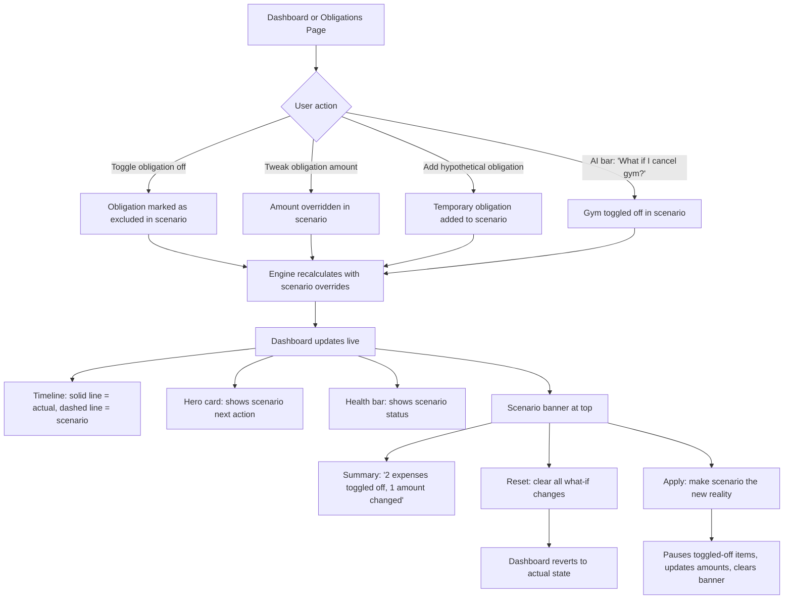

# What-If Modeling

## Overview

Inline scenario exploration integrated directly into the existing dashboard and obligation views. Users can toggle obligations on/off or tweak amounts and immediately see the impact on the timeline chart, hero card, and health bar. No separate mode or page — scenarios are overlaid on top of the real data. What-if state is session-only and lightweight.

## User Flow

## Behavior

### Activating What-If Mode

- Any obligation can be toggled off via a switch/toggle control on the obligations list or detail view
- Any obligation amount can be temporarily overridden by entering a different number
- User can add a hypothetical obligation (exists only in the scenario, not persisted)
- What-if can also be triggered from the floating AI bar:
  - "What if I cancel gym?" → toggles gym obligation off
  - "What if Netflix goes up to $30?" → overrides Netflix amount
  - "What if I add a $2,000 holiday in December?" → adds a hypothetical one-off obligation
  - "What if I cancel gym and Netflix?" → toggles both off

### Dashboard Overlay

- **Timeline chart**: actual projection as a solid line, scenario projection as a dashed line — both visible simultaneously for comparison
- **Hero card**: shows the scenario's next action amount and deadline (with a visual indicator that this is a what-if, not reality)
- **Health bar**: reflects the scenario's funded vs. required status
- All three update live as the user toggles and tweaks

### Scenario Banner

- Appears at the top of the dashboard when any what-if changes are active
- Shows a summary of changes: "2 expenses toggled off, 1 amount changed"
- **Reset button**: clears all what-if changes, dashboard reverts to actual state
- **Apply button**: makes the scenario real — pauses toggled-off obligations, updates modified amounts, removes hypothetical items or saves them as real obligations
- Applying triggers a confirmation dialog listing all changes that will be made

### Session-Only State

- What-if state lives entirely in client-side state
- Does not persist across page refreshes or sessions
- This keeps it lightweight and low-risk — exploring scenarios is free and instant
- No database writes until/unless the user clicks Apply

## Data Model

- No persistent models — what-if state lives in client-side state only (React state/context)
- The sinking fund engine exposes a calculation function that accepts overrides as parameters, so the same engine produces both actual and scenario projections

## Edge Cases

- Toggle off all obligations: shows a "fully funded" scenario (valid use case — see what baseline looks like)
- Income is not toggleable in what-if v1: keeps scope manageable (could be added later)
- Add a hypothetical that pushes contributions beyond capacity: shortfall warning appears in scenario mode
- Reset with many changes: no confirmation needed (nothing was persisted, exploration is free)
- Multiple what-if adjustments to the same item: last change wins
- Apply with hypothetical obligations: prompt user to fill in any missing details (e.g. fund group) before saving as a real obligation
- AI bar what-if while already in what-if mode: changes are additive (new toggles/tweaks add to existing scenario)

## Acceptance Criteria

- [ ] User can toggle obligations off to see impact on dashboard
- [ ] User can temporarily change obligation amounts
- [ ] User can add hypothetical obligations to the scenario
- [ ] What-if can be triggered via the floating AI bar
- [ ] Timeline shows actual (solid) vs. scenario (dashed) lines simultaneously
- [ ] Hero card reflects scenario calculations with visual indicator
- [ ] Health bar reflects scenario funded vs. required status
- [ ] Scenario banner appears with change summary
- [ ] Reset button clears all what-if changes
- [ ] Apply button makes scenario changes permanent (with confirmation dialog)
- [ ] Applying pauses toggled-off obligations and updates modified amounts
- [ ] What-if state is client-side only — does not persist on refresh
- [ ] Multiple AI bar what-if commands are additive
- [ ] Shortfall warnings appear in scenario mode when capacity is exceeded
