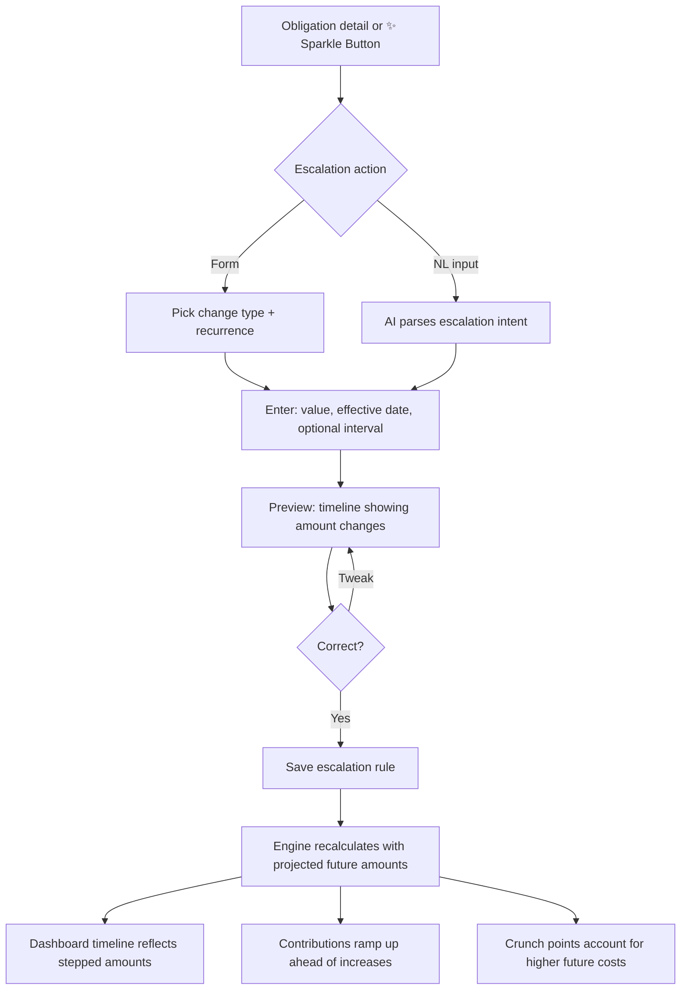

# Obligation Amount Escalation

## Overview

Users can model future price changes on obligations — rent going up annually, subscription price hikes, insurance premiums increasing at renewal. The sinking fund engine uses escalation data to project future amounts so contributions ramp up before increases hit, shortfalls are detected early, and crunch points account for higher future costs.

Escalation has two orthogonal dimensions:

**Change type** — how the new amount is determined:
1. **Absolute** — set to a specific amount ("rent goes to $2,200")
2. **Percentage** — increase by a percentage of the current amount ("rent goes up 3%")
3. **Fixed increase** — increase by a dollar amount ("rent goes up $50")

**Recurrence** — when it happens:
1. **One-off** — a single change on a specific date
2. **Recurring** — repeats every N months from an anchor date

Five of the six combinations are valid — recurring absolute doesn't make sense (you wouldn't say "set to $2,500 every July"). Absolute is one-off only. Escalation is optional — an obligation with no escalation works exactly as it does today.

## User Flow

## Behavior

### Escalation Rules

- Each escalation rule specifies a change type (absolute, percentage, or fixed increase), a value, an effective date, and optionally a recurrence interval
- An obligation can have multiple escalation rules — e.g. a one-off step to $2,200 in July plus a recurring 3% annual increase starting July next year
- **One-off rules**: once the effective date passes, the obligation's base amount updates and the rule is marked as applied. Applied rules are kept for history but no longer affect calculations.
- **Recurring rules**: the engine projects future amounts by applying the change at each interval. Only one recurring rule per obligation (setting a new one replaces the old). Projected future amounts are computed on the fly, not persisted.
- Rules are visible on the obligation detail as a timeline of upcoming changes
- Examples of the five valid combinations:
  - One-off absolute: "Rent goes to $2,200 in July"
  - One-off percentage: "Insurance goes up 8% at renewal in March"
  - One-off fixed increase: "Netflix is going up $3 next month"
  - Recurring percentage: "Rent goes up 3% every July"
  - Recurring fixed increase: "Rent goes up $50 every July"

### Engine Integration

- When calculating future contributions, the engine uses the escalated amount for each period rather than the current amount
- For the timeline projection (6-12 months on the dashboard), each obligation's future due dates use the amount that will be in effect at that point
- Shortfall detection accounts for the higher future amounts — a user who is on track today may have a projected shortfall after an increase
- Crunch point detection uses escalated amounts so it warns about post-increase crunches, not just current ones
- Ramp-up: the engine starts increasing contributions ahead of a price increase so the user isn't hit with a sudden jump on the effective date

### Sparkle Button Integration

- The ✨ sparkle button on an obligation gains a new preset: **Add price change**
- Tapping it opens a mini-form: change type (absolute / percentage / fixed increase), value, effective date, and an optional "repeats every N months" toggle
- The existing "Change amount" preset changes the current amount immediately; "Add price change" schedules a future change

### What-If Integration

- Users can add hypothetical escalation steps in what-if mode: "What if rent goes up 5% next year?"
- Hypothetical escalation follows the same session-only rules as other what-if changes
- The scenario timeline reflects the hypothetical escalated amounts

## NL Examples

These fit the AI interaction layer design from spec 09 — all go through the same Claude API intent parser (not regex) and always show a preview before saving. The LLM returns an `escalation` intent type with structured fields (`obligationName`, `changeType`, `value`, `effectiveDate`, `intervalMonths`):

- "My rent goes up to $2,200 in July" (one-off absolute)
- "Insurance goes up 8% at renewal in March" (one-off percentage)
- "Netflix is going up $3 next month" (one-off fixed increase)
- "Rent increases 3% every year in July" (recurring percentage)
- "Rent goes up $50 every July" (recurring fixed increase)
- "Add a 5% annual increase to rent starting July 2027" (recurring percentage with explicit anchor)
- "What if rent goes up 5% next year?" (triggers what-if mode)
- "Cancel the rent increase" (removes a one-off rule)
- "Remove the annual increase on rent" (removes the recurring rule)

## Data Model

Single new model — attaches to the existing `Obligation` without modifying its current fields:

- `Escalation`: id, obligationId, changeType (enum: absolute, percentage, fixed_increase), value (decimal), effectiveDate (date), intervalMonths (int, nullable — null means one-off), isApplied (boolean, default false), appliedAt (datetime, nullable), createdAt, updatedAt

Constraints:
- An obligation can have zero or many `Escalation` records
- At most one recurring escalation per obligation (unique partial index on obligationId where intervalMonths is not null) — setting a new recurring rule replaces the old one
- For `absolute` change type, `value` is the target amount (e.g. 2200 means "set to $2,200")
- For `percentage` change type, `value` is the percentage (e.g. 3 means "increase by 3%")
- For `fixed_increase` change type, `value` is the dollar increase (e.g. 50 means "increase by $50")
- `intervalMonths` is typically 12 (annual) but supports other intervals
- `effectiveDate` is when the first/only change applies — for recurring rules, subsequent changes occur at effectiveDate + N * intervalMonths
- `isApplied` is only used for one-off rules; recurring rules are never marked as applied
- `absolute` change type is only valid for one-off rules (intervalMonths must be null) — enforced at the application layer

## Edge Cases

- One-off rule in the past: if a user adds a one-off rule with an effective date that has already passed, apply it immediately (update the obligation's base amount and mark the rule as applied)
- Overlapping one-off rules on the same date: last one saved wins (warn the user if a rule already exists for that date)
- Recurring rule on a custom schedule obligation: applies to all future entries that fall after the next escalation date — the engine generates projected custom schedule entries with the escalated amounts
- Recurring rule with 0% or $0 value: valid (effectively disables escalation without deleting) — but show a hint that this has no effect
- Very high percentage (>50%) or very large fixed increase (>50% of current amount): show a confirmation — "This will more than double the amount. Is that right?"
- Obligation paused with escalation: rules are preserved but one-off rules are not auto-applied while paused — when the obligation is resumed, any one-off rules whose effective date has passed are applied immediately
- Deleting an obligation: cascade deletes its escalation rules
- Editing the obligation's base amount: does not affect future absolute one-off rules (they are target amounts) but does affect the next projected amount from percentage and fixed increase rules (since the new base is used for computation)
- One-off obligations: escalation doesn't apply (no recurring future to escalate) — the UI hides escalation options for one-off type
- Conflicting one-off and recurring on the same date: one-off takes precedence for that specific date, recurring resumes on the next interval

## Acceptance Criteria

- [ ] User can add a one-off escalation (absolute, percentage, or fixed increase) with an effective date
- [ ] User can add a recurring escalation (percentage or fixed increase) with an interval and anchor date
- [ ] User can add multiple one-off rules to a single obligation
- [ ] Only one recurring rule per obligation (new replaces old)
- [ ] Escalation can be added via the sparkle button "Add price change" preset
- [ ] Escalation can be added via NL input through the floating AI bar
- [ ] All NL examples in this spec parse correctly
- [ ] Preview shows the timeline of amount changes before saving
- [ ] Engine uses escalated amounts for future contribution calculations
- [ ] Engine ramps up contributions ahead of scheduled increases
- [ ] Shortfall detection accounts for escalated future amounts
- [ ] Crunch point detection uses escalated amounts
- [ ] Dashboard timeline chart reflects escalated amounts at future due dates
- [ ] Applied one-off rules update the obligation's base amount automatically
- [ ] Applied rules are kept for history
- [ ] What-if mode supports hypothetical escalation rules
- [ ] Paused obligations preserve escalation rules and apply pending one-offs on resume
- [ ] Escalation options are hidden for one-off obligations
- [ ] Deleting an obligation cascades to its escalation data
- [ ] Past-date one-off rules are applied immediately on creation
- [ ] One-off rules take precedence over recurring rules when they fall on the same date
