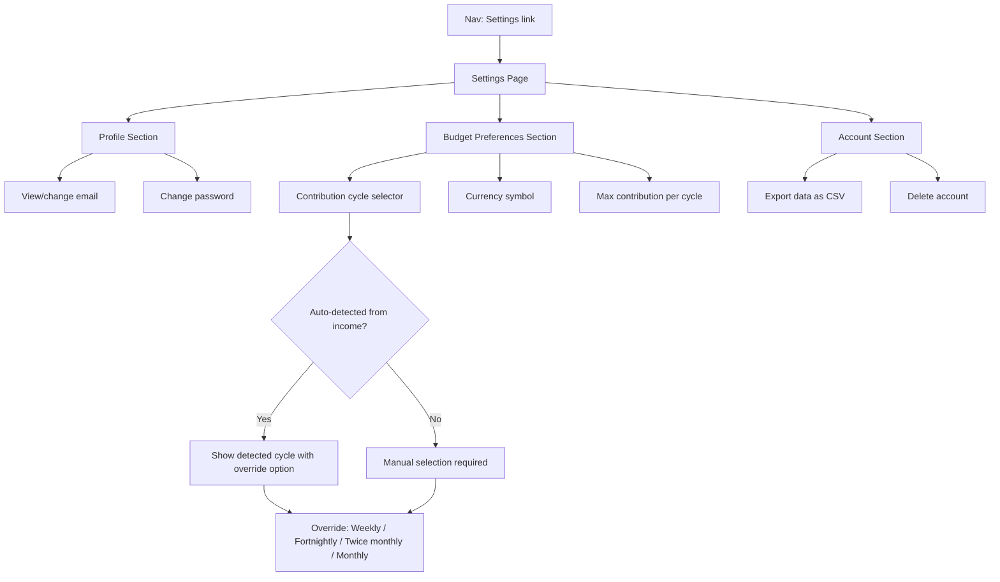

# Settings & Profile

## Overview

A settings page where users can manage their profile (email, password), configure budget preferences (contribution cycle, currency, max contribution), and perform account actions. This is also where the contribution cycle — the backbone of the sinking fund engine's per-cycle math — gets configured properly based on pay frequency.

## User Flow



## Behavior

### Profile

- User can view their current email address
- User can change their email (requires current password confirmation)
- User can change their password (requires current password, new password with confirmation)
- Validation: email format, password minimum length (8 chars), new password must differ from current

### Budget Preferences

#### Contribution Cycle

The contribution cycle determines how often the user sets aside money. The engine counts actual pay dates between now and each due date to calculate cycles-until-due, then divides the remaining amount by that count.

- **Auto-detection**: if the user has regular (non-irregular) income sources, derive the cycle from the most frequent income's frequency:
  - Weekly income → weekly cycle (every 7 days)
  - Fortnightly income → fortnightly cycle (every 14 days)
  - Twice-monthly income → twice-monthly cycle (two fixed dates per month)
  - Monthly income → monthly cycle (one fixed date per month)
- **Manual override**: user can always override with one of the four standard options:
  - Weekly (every 7 days)
  - Fortnightly (every 14 days)
  - Twice monthly (two dates per month, e.g. 1st & 15th)
  - Monthly (one date per month)
- **Display**: show the auto-detected value (if any) as a recommendation, with the current selection highlighted

##### Cycle counting: calendar-based, not day-division

The engine must **not** divide days-until-due by a fixed interval. Semi-monthly pay is a calendar concept — the gaps between pay dates vary (14 days for 1st→15th, but 13–17 days for 15th→1st depending on month length). Dividing by 15 can lose an entire cycle in short windows involving February, causing per-cycle amounts to double.

Instead, the engine counts actual cycle occurrences between now and the due date:
- **Weekly/fortnightly**: count occurrences of the pay weekday in the date range (or divide by 7/14 — these are true fixed-interval cycles)
- **Twice-monthly**: given pay days [d1, d2], count how many of those dates fall between now and the due date. Uses calendar math, not day division.
- **Monthly**: count how many months (with the pay day clamped to last-of-month) fall between now and the due date.

##### End-of-month clamping

When a pay day or due date falls on a day that doesn't exist in a given month (e.g. the 30th in February, or the 31st in April), clamp to the last day of that month. This is the standard financial convention (the "End of Month" rule).

- When the cycle changes, trigger an engine recalculation

#### Currency Symbol

- User can change their currency symbol (set during onboarding, editable here)
- Default: `$`
- Common options shown as quick picks: `$`, `£`, `€`, `¥`, `A$`, `NZ$`
- Free text input for any symbol

#### Max Contribution Per Cycle

- Optional cap on how much the engine recommends setting aside per cycle
- If total required exceeds this cap, the engine prioritizes by nearest due date and warns about shortfalls
- User can clear the cap (no limit)

### Account

- **Export data**: download all transactions, obligations, income sources, and contribution records as CSV files (zipped)
- **Delete account**: permanently deletes all user data after confirmation ("Type DELETE to confirm")

## Data Model

### Schema Changes

Add `twice_monthly` to the `IncomeFrequency` enum:

```
enum IncomeFrequency {
  weekly
  fortnightly
  twice_monthly    // NEW — 1st & 15th, or similar fixed dates
  monthly
  quarterly
  annual
  custom
  irregular
}
```

Add cycle type and pay days to the User model:

```
enum ContributionCycleType {
  weekly        // every 7 days
  fortnightly   // every 14 days
  twice_monthly // two fixed dates per month
  monthly       // one fixed date per month
}
```

Updated `User` fields:
- `User.contributionCycleType` (ContributionCycleType, nullable) — the cycle type; null means auto-detect from income
- `User.contributionPayDays` (Int[], default []) — day-of-month for twice_monthly (e.g. [1, 15]) or monthly (e.g. [1]). Ignored for weekly/fortnightly.
- `User.contributionCycleDays` (Int, nullable) — **deprecated**, kept for backward compatibility during migration. New code uses cycleType + payDays.
- `User.maxContributionPerCycle` (Float, nullable) — max per-cycle cap
- `User.currencySymbol` (String, default "$") — display currency

### API Endpoints

- `GET /api/user/settings` — returns current user settings (email, cycle, currency, max contribution)
- `PUT /api/user/settings` — updates preferences (cycle, currency, max contribution). Triggers engine recalculation.
- `PUT /api/user/email` — updates email (requires current password)
- `PUT /api/user/password` — updates password (requires current password + new password)
- `POST /api/user/export` — generates and returns data export
- `DELETE /api/user/account` — deletes account (requires confirmation token)

## Edge Cases

- No income sources: auto-detection shows "No income configured — select a cycle manually" with monthly pre-selected
- Multiple income sources with different frequencies: use the most frequent (shortest cycle) as the recommendation, since that determines the finest-grained contribution schedule
- User changes cycle: engine recalculates immediately, contribution amounts change across all obligations
- Invalid email format: inline validation error
- Wrong current password: clear error message, don't reveal which field is wrong
- Export with large dataset: generate async if needed, show progress
- Delete account: require typing "DELETE", then hard-delete all data with no recovery

## Acceptance Criteria

- [ ] Settings page is accessible from the nav bar
- [ ] User can view their email address
- [ ] User can change their email with password confirmation
- [ ] User can change their password
- [ ] Contribution cycle shows auto-detected recommendation from income data
- [ ] User can override cycle to weekly / fortnightly / twice monthly / monthly
- [ ] Twice-monthly uses calendar-based cycle counting (not day division)
- [ ] End-of-month clamping works correctly (30th in Feb → 28th/29th)
- [ ] Cycle changes trigger engine recalculation
- [ ] User can change currency symbol
- [ ] User can set or clear max contribution per cycle
- [ ] User can export their data
- [ ] User can delete their account with confirmation
- [ ] All preference changes persist and take effect immediately
- [ ] `twice_monthly` frequency option is available for income sources
