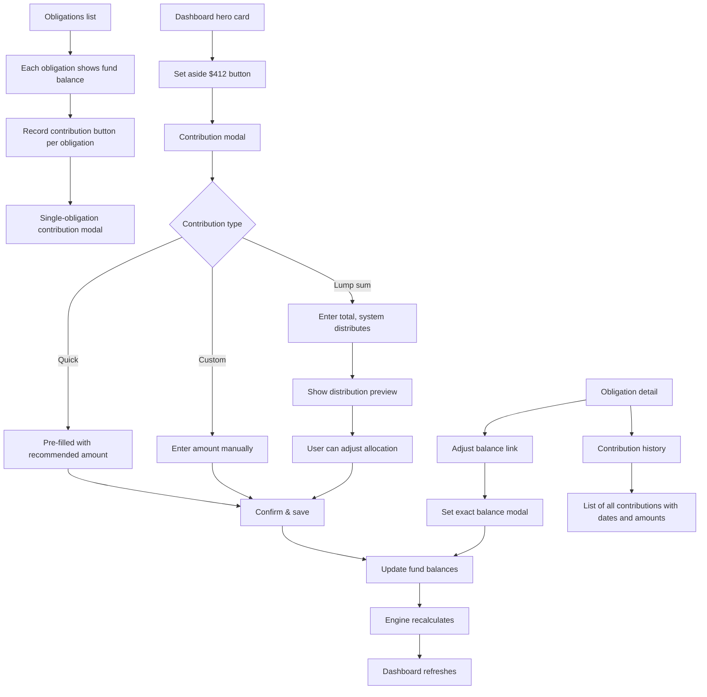

# Contributions & Catch-Up

## Overview

Users need to record when they've set money aside and see their fund balances. This spec covers: recording per-obligation contributions, recording lump sum contributions that get distributed across obligations, manually adjusting fund balances, and viewing contribution history. The backend APIs already exist — this is primarily a frontend spec.

## User Flow

## Behavior

### Recording a Contribution (Single Obligation)

- From the obligations list or obligation detail, user taps "Record contribution"
- Modal shows the obligation name, current balance, amount needed, and the engine's recommended per-cycle contribution pre-filled
- User can accept the recommended amount or enter a custom amount
- On save: POST to `/api/contributions`, fund balance updates, engine recalculates
- Dashboard and obligation list refresh via `budget-data-changed` event

### Recording a Contribution (Dashboard Quick Action)

- The dashboard hero card ("Set aside $412") has a "Done" or "Mark as done" button
- Clicking it opens a contribution modal pre-filled with the hero card amount and the target obligation
- Same flow as single-obligation contribution

### Lump Sum Catch-Up

When a user is behind on multiple obligations and wants to drop a larger amount to catch up:

- Accessible from a "Catch up" button on the dashboard (shown when multiple obligations are underfunded)
- User enters a total lump sum amount (e.g. "$2,000")
- System shows a distribution preview: how the lump sum would be allocated across obligations
- **Distribution priority**: nearest due date first (same priority as the engine uses for regular contributions). Each obligation gets up to its remaining shortfall before the next one receives funds.
- User can manually adjust the per-obligation allocation in the preview (drag sliders or edit amounts)
- Manual adjustments must sum to the total lump sum (system auto-adjusts the last item)
- On confirm: one POST to `/api/contributions` per obligation that receives funds, then engine recalculates once
- The contribution records are created with type `contribution` and a note like "Lump sum catch-up"

### Adjusting a Fund Balance

- From the obligation detail, user can "Adjust balance" to set the exact fund balance
- Use case: user checks their actual bank account and wants to reconcile
- Shows current balance, user enters new balance
- On save: PUT to `/api/fund-balances/[obligationId]`, creates a `manual_adjustment` contribution record
- Supports both increasing and decreasing the balance

### Fund Balance Display

- Each obligation in the list shows its fund balance alongside the amount needed:
  - Progress bar or text: "$350 of $1,000 saved" or "35% funded"
  - Color: green (≥80%), amber (40-79%), red (<40%)
- The upcoming obligations section on the dashboard already has a fund status field — make sure it renders: "Fully funded", "Partially funded ($X of $Y)", or "Unfunded"

### Contribution History

- Accessible from each obligation's detail view
- Shows a chronological list of all contributions and manual adjustments
- Each entry shows: date, amount, type (contribution or adjustment), and optional note
- Lightweight — no pagination needed initially (contributions are infrequent)

## Data Model

No schema changes needed. Existing models are sufficient:

- `FundBalance`: per-obligation balance tracking (already exists)
- `ContributionRecord`: audit trail of all contributions and adjustments (already exists)
  - `type`: `contribution` | `manual_adjustment`
  - `note`: nullable string (used for lump sum notes, adjustment reasons)

### Existing API Endpoints (already implemented and tested)

- `POST /api/contributions` — record a contribution (increments balance)
- `PUT /api/fund-balances/[obligationId]` — set exact balance (manual adjustment)

### New API Endpoint

- `POST /api/contributions/bulk` — record contributions for multiple obligations in one request (for lump sum). Accepts array of `{ obligationId, amount }`, creates records, updates balances, triggers one engine recalculation.

## Edge Cases

- Contribution amount exceeds remaining need: allow it (user may want to over-fund). Fund balance can exceed amount needed — engine treats this as fully funded with zero contribution.
- Lump sum smaller than total shortfall: distribute pro-rata by urgency (nearest due date gets full allocation first, then next, etc.). Remaining obligations stay underfunded.
- Lump sum exactly covers all shortfalls: all obligations become fully funded. Celebration state.
- Lump sum with zero shortfall (all already funded): show message "All obligations are already fully funded — no catch-up needed"
- Negative adjustment: user sets balance lower than current. Creates a negative `manual_adjustment` record. Valid use case (reconciliation found less than expected).
- Zero contribution: reject with validation error
- Contribution while obligation is paused: allow it (user may be pre-funding before unpausing)
- Concurrent contributions: fund balance uses upsert with increment, so concurrent writes are safe

## Acceptance Criteria

- [ ] Each obligation in the list shows its fund balance with visual indicator
- [ ] User can record a contribution for a single obligation
- [ ] Contribution modal pre-fills with the engine's recommended amount
- [ ] Dashboard hero card has a "Mark as done" action that records the contribution
- [ ] User can record a lump sum contribution distributed across multiple obligations
- [ ] Lump sum distribution preview shows per-obligation allocation
- [ ] User can adjust lump sum allocation before confirming
- [ ] Distribution prioritizes nearest due date (most urgent first)
- [ ] User can manually adjust (set exact) fund balance for any obligation
- [ ] Contribution history is viewable per obligation
- [ ] All contributions trigger engine recalculation
- [ ] Dashboard and obligation list refresh after contributions
- [ ] Over-funding is allowed (balance can exceed amount needed)
- [ ] Validation prevents zero or negative contributions (but allows negative adjustments)
