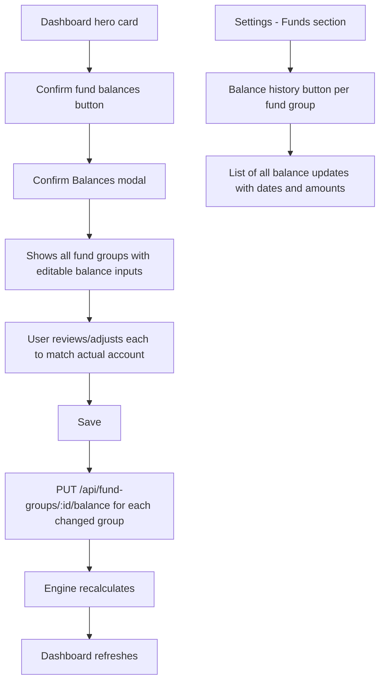

# Balance Confirmation

## Overview

Users periodically confirm what their fund accounts actually hold. The system compares expected vs. actual and adjusts. This replaces the previous per-contribution recording model where users recorded individual deposits.

The projection chart already assumes contributions happen every pay cycle, so individual deposit tracking adds friction without value. Instead, users confirm their actual fund balances periodically, and the system creates audit records for the changes.

## User Flow

```mermaid
flowchart TD
    A[Dashboard hero card] --> B["Confirm fund balances" button]
    B --> C[Confirm Balances modal]
    C --> D[Shows all fund groups with editable balance inputs]
    D --> E[User reviews/adjusts each to match actual account]
    E --> F[Save]
    F --> G[PUT /api/fund-groups/:id/balance for each changed group]
    G --> H[Engine recalculates]
    H --> I[Dashboard refreshes]

    J[Settings - Funds section] --> K["Balance history" button per fund group]
    K --> L[List of all balance updates with dates and amounts]
```

## Behavior

### Confirming Fund Balances (Dashboard)

- Dashboard hero card (not-fully-funded state) shows a "Confirm fund balances" button
- Button visible when not in what-if mode and fund groups exist
- Opens a modal showing all fund groups with current stored balance in editable inputs
- User reviews/adjusts each to match their actual account
- On save: calls `PUT /api/fund-groups/[id]/balance` for each changed group
- The existing API already creates `manual_adjustment` audit records
- Dispatches `budget-data-changed` once when done
- Dashboard and obligation list refresh

### Balance History

- Accessible from the Funds section in Settings — each fund group has a "Balance history" button
- Shows a chronological list of all balance updates for that fund group
- Each entry shows: date, amount, type badge ("Balance update" or "Adjustment"), and optional note
- Only one fund group's history is expanded at a time

## Data Model

No schema changes. Existing models are sufficient:

- `FundGroup.currentBalance`: per-fund-group balance tracking
- `ContributionRecord`: audit trail of all balance changes
  - `type`: `contribution` | `manual_adjustment`
  - `note`: nullable string

### Existing API Endpoints (no changes needed)

- `PUT /api/fund-groups/[id]/balance` — set exact balance (creates manual_adjustment record)
- `GET /api/contributions/[fundGroupId]` — history of balance changes

### Removed API Endpoints

- `POST /api/contributions` — no longer needed (individual contribution recording removed)
- `POST /api/contributions/bulk` — no longer needed (lump sum catch-up removed)

## Edge Cases

- All balances unchanged: save button should still work (no API calls made, modal closes)
- Negative balance: reject with validation error (balance cannot be negative)
- Zero balance: allowed (user may have emptied a fund)

## Acceptance Criteria

- [x] Dashboard hero card shows "Confirm fund balances" button (not-fully-funded, not what-if, fund groups exist)
- [x] ConfirmBalancesModal shows all fund groups with editable balance inputs
- [x] Saving updates only changed balances via existing PUT API
- [x] Dashboard refreshes after confirming balances
- [x] Balance history is viewable per fund group in Settings > Funds
- [x] "Record contribution" button and ContributionModal removed
- [x] "Catch up" button and CatchUpModal removed
- [x] POST /api/contributions and POST /api/contributions/bulk routes removed
